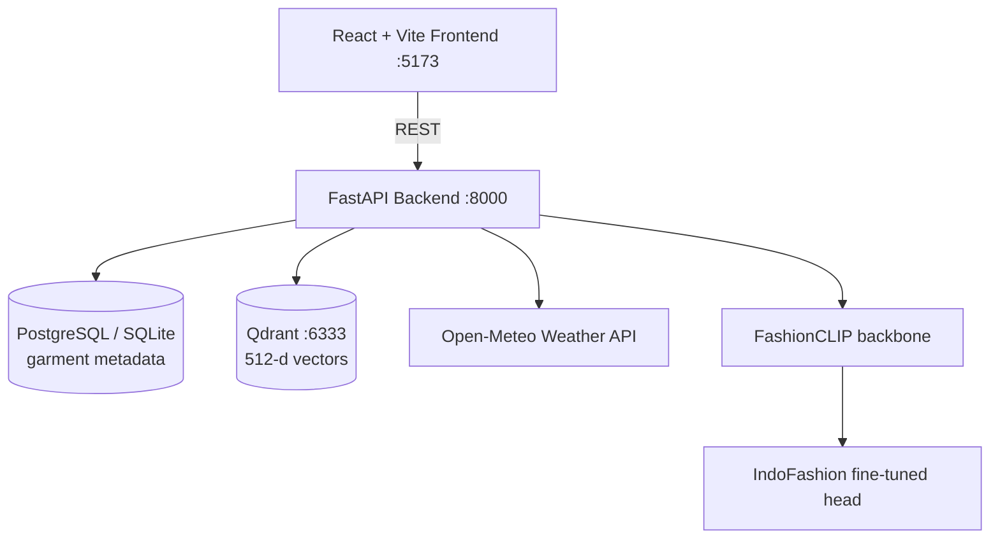
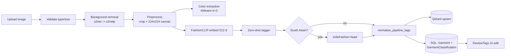
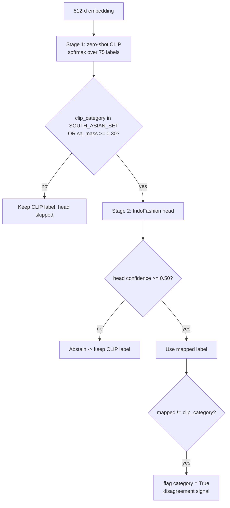
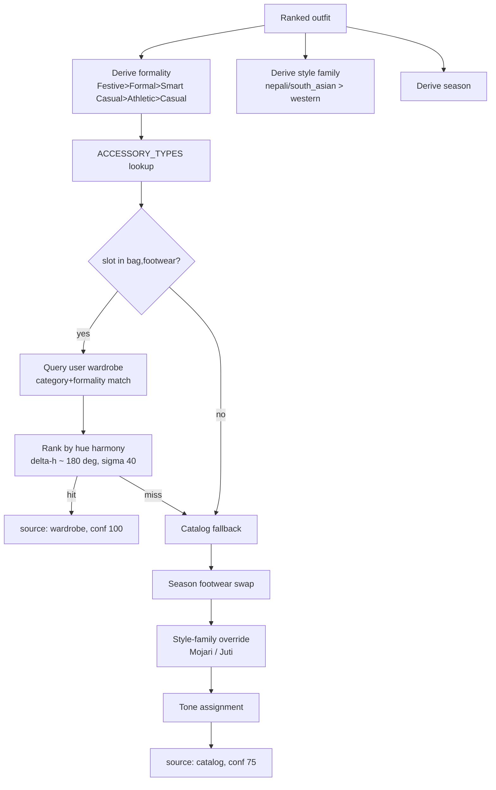

# MyStyla — Final Project Documentation

AI-assisted wardrobe digitisation and outfit recommendation system with first-class
support for Nepali and South Asian garments.

This document consolidates the full system specification, architecture, model
training details, evaluation results, and the resolved design questions needed for
the final report. Setup and run instructions live in [README.md](README.md).

---

## Table of Contents

1. [System Architecture](#1-system-architecture)
2. [End-to-End Pipeline](#2-end-to-end-pipeline)
3. [Category Taxonomy](#3-category-taxonomy)
4. [Nepali and South Asian Garment Handling](#4-nepali-and-south-asian-garment-handling)
5. [Datasets](#5-datasets)
6. [Model Training](#6-model-training)
7. [Consolidated Thresholds](#7-consolidated-thresholds)
8. [Outfit Matching Algorithm](#8-outfit-matching-algorithm)
9. [Recommendation Module](#9-recommendation-module)
10. [Weather Model](#10-weather-model)
11. [Evaluation and Results](#11-evaluation-and-results)
12. [Testing](#12-testing)
13. [Data Models and Storage](#13-data-models-and-storage)
14. [Integration Fixes Applied](#14-integration-fixes-applied)
15. [Documentation Q&A — Eight Resolved Questions](#15-documentation-qa--eight-resolved-questions)
16. [Session Q&A — Integration and Release](#16-session-qa--integration-and-release)
17. [Known Limitations](#17-known-limitations)
18. [Reproduction Runbook](#18-reproduction-runbook)

---

## 1. System Architecture



### Service responsibilities

| Service | Port | Responsibility |
|---|---|---|
| FastAPI backend | 8000 | Upload, background removal, classification, matching, recommendation |
| React frontend | 5173 | Auth, wardrobe UI, scan/review, outfit matcher, suggestions |
| Qdrant | 6333 | 512-dimensional vector storage and similarity search |
| PostgreSQL / SQLite | — | Garment metadata, classifications, tag corrections |
| Open-Meteo | — | Current weather, no API key required |

### Router map

Wired in `backend/main.py`.

| Router | Prefix | Source |
|---|---|---|
| Scanning / upload | `/scanning` | `app/scanning/upload.py` |
| Search | `/scanning` | `app/scanning/search.py` |
| Auth | `/` | `app/user_registration/auth_router.py` |
| Outfit matching | `/outfits` | `app/outfit_matching/router.py` |
| Recommendation | `/recommend` | `app/recommendation_router.py` |
| Classification | `/classification` | `app/classification/routes.py` |
| Weather | `/weather` | `app/weather/router.py` |

Static mounts: `/uploads` and `/processed`.

---

## 2. End-to-End Pipeline



| Stage | File | Key parameters |
|---|---|---|
| Upload validation | `app/scanning/upload.py` | JPEG/PNG/WEBP, max 10 MB |
| Background removal | `app/scanning/remove_bg.py` | primary `u2net`, fallback `u2netp`, long edge 1536 → 1024 |
| Preprocess | `app/scanning/preprocess.py` | alpha bbox crop, LANCZOS, 224×224 transparent canvas |
| Color extraction | `app/scanning/color_extract.py` | KMeans `n_clusters=3`, `n_init=10`, `random_state=42` |
| Embedding | `app/classification/fashion_clip_model.py` | `patrickjohncyh/fashion-clip`, 512-d |
| Tagging | `app/classification/multi_label_tagger.py` | two-stage router, see §7 |
| Normalization | `app/classification/normalization.py` | fine → broad category, season guard |
| Vector store | `app/scanning/vector_store.py` | collection `wardrobe`, size 512, COSINE |

Background removal is lock-serialised (`threading.Lock`) to avoid concurrent ONNX
allocations within one worker, and sessions are cached after first load.

---

## 3. Category Taxonomy

### 3.1 Classifier label space — 75 fine-grained labels

| Group | Count | Labels |
|---|---:|---|
| Tops | 8 | t-shirt, shirt, blouse, tank top, polo, crop top, tube top, bodysuit |
| Sweaters & knits | 5 | sweater, cardigan, hoodie, sweatshirt, turtleneck |
| Outerwear | 8 | jacket, denim jacket, leather jacket, blazer, coat, parka, windbreaker, vest |
| Bottoms | 7 | jeans, trousers, chinos, cargo pants, joggers, leggings, shorts |
| Skirts | 4 | skirt, mini skirt, maxi skirt, pleated skirt |
| Dresses & sets | 4 | dress, jumpsuit, romper, co-ord set |
| Formalwear | 3 | suit, tuxedo, gown |
| Footwear | 7 | sneakers, boots, sandals, heels, flats, loafers, mojari |
| Accessories | 9 | belt, hat, scarf, gloves, tie, bag, sunglasses, jewelry, watch |
| South Asian | 8 | kurti, kurta, saree, lehenga, sherwani, salwar suit, anarkali, dhoti |
| Nepali | 12 | daura suruwal, gunyu cholo, haku patasi, labeda suruwal, dhaka topi, phariya, cholo, patuka, ghalek, mujetro, bakkhu, gurung dress |

### 3.2 Matcher categories — 15 valid values

- **Structural (4):** `top`, `bottom`, `dress`, `outerwear`
- **Accessory (11):** `footwear`, `accessories`, `bag`, `jewelry`, `watch`, `belt`, `hat`, `scarf`, `gloves`, `tie`, `sunglasses`

Outfit templates use only the structural four:
`["top","bottom"]`, `["dress"]`, with `outerwear` optional.

### 3.3 Other vocabularies

| Vocabulary | Count | Values |
|---|---:|---|
| FORMALITY | 5 | Casual, Smart Casual, Formal, Athletic, Festive |
| SEASON | 5 | Spring, Summer, Autumn, Winter, All-Season |
| PATTERN | 5 | Solid, Striped, Checked, Graphic, Floral |
| OCCASION | 18 | 8 classifier-assignable + 10 query-only |

Classifier-assignable occasions (8): Casual, Office, Party, Date, Farewell,
Wedding, Puja, Festival.

Query-only occasions (10): College, Shopping, Travel, Meeting, Interview,
Presentation, Dinner, Birthday, Religious Ceremony, Graduation.

Query-only occasions resolve through `OCCASION_CLUSTERS` — five clusters:
`everyday`, `formal_professional`, `evening_social`, `festive_traditional`,
`milestone`.

---

## 4. Nepali and South Asian Garment Handling

Three distinct mechanisms.

### 4.1 Engineered CLIP prompts

Generic prompts fail for Nepali wear, so `NEPALI_PROMPTS` supplies visually
descriptive prompts instead of `"a photo of a {category}"`.

| Garment | Prompt strategy |
|---|---|
| daura suruwal | cream men's outfit, closed-neck double-breasted long shirt with cloth ties, tapered trousers |
| gunyu cholo | red cloth wrapped as skirt over fitted blouse with shoulder sash |
| haku patasi | black cotton sari with wide deep-red border, fitted cropped blouse (Newar) |
| labeda suruwal | long straight knee-length tunic over loose wide trousers |
| phariya / cholo / patuka / ghalek / mujetro | Magar women's outfit components |
| bakkhu | Sherpa/Himalayan floor-length wrap robe with waist sash |
| gurung dress | velvet blouse, wrapped patterned skirt, red/gold shoulder sash |
| dhaka topi | stiff brimless cap with woven geometric pattern |

South Asian labels use `"a photo of traditional South Asian {cat}"`.

### 4.2 Two-stage router into specialist head



`south_asian_mass` is the summed softmax probability across the eight South Asian
labels. When the two models disagree, the category is flagged for user review —
treated as the strongest available uncertainty signal.

`INDOFASHION_TO_CATEGORY` maps head outputs back into app vocabulary:
`women_kurta → kurti`, `kurta_men → kurta`, `dupattas → scarf`,
`palazzos → trousers`, `nehru_jackets → vest`, `petticoats → skirt`,
`mojaris_men`/`mojaris_women → mojari`.

### 4.3 Style-family compatibility guard

Two layers.

**Layer 1 — ontology.** 50+ fine categories map to
`{role, sub_role, style_family, is_full_body}`. Roles: `upper`, `lower`,
`layering`, `one_piece`, `set`, `south_asian_upper`, `south_asian_lower`,
`south_asian_one_piece`, `south_asian_set`, `accessory`, `unknown`.

**Layer 2 — style family.** `nepali`, `south_asian`, `western`, `universal`
(heels, flats and sandals are universal and pair with anything).

Structural multiplier `rho(a, b)`:

| # | Condition | rho |
|---:|---|---:|
| 1 | full-body + partner role in {upper, lower, sa_upper, sa_lower} | **0.0** |
| 2 | full-body South Asian + non-South-Asian layering | **0.0** |
| 3 | both roles = layering | **0.0** |
| 4 | sherwani + {shorts, mini skirt, joggers, cargo pants} | **0.0** |
| 5 | long kurti/kurta + {shorts, mini skirt, cargo pants} | **0.0** |
| 6 | kurti/kurta + {jeans, trousers, leggings, dhoti, palazzo, maxi skirt} | **1.15** |
| 7 | cardigan + {tube top, crop top, tank top, t-shirt, jeans, trousers} | **1.1** |
| 8 | both style_family = south_asian | **1.1** |
| 9 | otherwise | **1.0** |

Rule 2 is the "no Western blazer over a lehenga" case. Rule 5 is length-aware and
only rejects when `tags["length"] == "long"`.

An outfit is structurally valid only if every pair passes:

```
valid(O)  <=>  for all i < j:  rho(g_i, g_j) > 0
```

This is applied in the ranker *before* scoring, so invalid combinations never
reach the scorer.

Traditional footwear is handled at recommendation time by
`STYLE_FOOTWEAR_OVERRIDE`: Formal + south_asian/nepali → **Mojari**;
Smart Casual + south_asian/nepali → **Juti**.

---

## 5. Datasets

| Dataset | Purpose | Split / size | Access |
|---|---|---|---|
| **IndoFashion** | Fine-tune 15-class specialist head | `train_data.json` / `val_data.json` / `test_data.json` | Kaggle archive via Google Drive |
| **Polyvore Outfits** (`mvasil/polyvore-outfits`) | Compatibility benchmark | disjoint split — 33,990 train / 6,000 valid / 30,290 test outfits | Gated HF dataset, requires auth |
| **Custom tagging eval** | Tagging accuracy on Nepali/mixed wardrobe | 30 garments | `backend/eval/ground_truth.json` |
| **Segmentation eval** | Background-removal IoU | 14 images incl. saree, lehenga, sherwani, gunyu cholo, haku patasi, labeda suruwal | `backend/eval/masks_true/` |

IndoFashion's 15 classes:

```
0 blouse            5 leggings_and_salwars  10 palazzos
1 dhoti_pants       6 lehenga               11 petticoats
2 dupattas          7 mojaris_men           12 saree
3 gowns             8 mojaris_women         13 sherwanis
4 kurta_men         9 nehru_jackets         14 women_kurta
```

Reproducibility notes:

- Five IndoFashion test images were missing and skipped or blank-padded
  (`413`, `501`, `759`, `1486`, `7047`).
- `mvasil/polyvore-outfits` raised `DatasetNotFoundError` until authenticated;
  metadata was staged through Drive.

---

## 6. Model Training

### 6.1 IndoFashion head — deployed

Frozen-backbone linear probe. FashionCLIP weights are never updated; features are
extracted once and cached to `extracted_features/{train,val,test}.pt`, and only a
small MLP head is trained. This avoids catastrophic forgetting of FashionCLIP's
general fashion semantics and keeps the checkpoint at ~543 KB.

**Architecture**

```
Linear(512 -> 256) -> ReLU -> Dropout(0.3) -> Linear(256 -> 15)
```

**Hyperparameters**

| Parameter | Value |
|---|---|
| Feature-extraction batch size | 64 |
| Training batch size | 128 |
| Optimizer | AdamW |
| Learning rate | 1e-3 |
| Weight decay | 1e-2 |
| Epochs | 10 |
| Loss | CrossEntropy |
| Inference temperature | 1.2 |
| Confidence threshold | 0.50 |

**Training curve**

| Epoch | Train Loss | Train Acc | Val Acc |
|---:|---:|---:|---:|
| 1 | 0.7084 | 79.59% | 85.75% |
| 2 | 0.4107 | 87.20% | 87.32% |
| 3 | 0.3797 | 88.21% | 87.71% |
| 4 | 0.3611 | 88.81% | 88.05% |
| 5 | 0.3478 | 89.16% | 87.92% |
| 6 | 0.3355 | 89.56% | 88.33% |
| 7 | 0.3269 | 89.72% | 88.53% |
| 8 | 0.3190 | 89.96% | 88.64% |
| 9 | 0.3113 | 90.27% | 88.59% |
| 10 | 0.3060 | **90.36%** | **88.71%** |

**Final test accuracy: 88.93%**

**Checkpointing.** One checkpoint only — the final epoch-10 state, written
unconditionally after the loop, at `ml_experiments/indofashion_head.pth`
(543,479 bytes). No per-epoch snapshots and no best-validation selection.
Validation accuracy was still rising at epoch 10, so the final epoch was close to
optimal, but best-checkpointing would have been the more defensible protocol.

Additional artifacts: `indofashion_confusion_matrix.png` (normalised, 300 dpi) and
`indofashion_service.py`, vendored into `ml_experiments/`.

### 6.2 Polyvore compatibility head — benchmark only, not deployed

Pairwise compatibility over FashionCLIP embeddings. Input is the concatenation
`[a, b, a*b]` — 512 × 3 = 1536 dimensions.

**Architecture**

```
Linear(1536 -> 256) -> ReLU -> Dropout(0.3) -> Linear(256 -> 64) -> ReLU -> Linear(64 -> 1)
```

**Pairwise dataset**

| Split | Outfits | Generated pairs |
|---|---:|---:|
| Train | 33,990 | 385,784 |
| Valid | 6,000 | 69,234 |
| Test | 30,290 | 330,946 |

**Hyperparameters**

| Parameter | Value |
|---|---|
| Embedding batch size | 32 |
| Training batch size | 256 |
| Optimizer | Adam |
| Learning rate | 1e-3 |
| Epochs | 15 |
| Loss | BCEWithLogitsLoss |
| Checkpoint rule | save on improved validation AUC |

**Validation AUC per epoch**

| Epoch | Train Loss | Val AUC | Saved |
|---:|---:|---:|:--:|
| 1 | 0.6425 | 0.7138 | yes |
| 2 | 0.6164 | 0.7323 | yes |
| 3 | 0.6021 | 0.7437 | yes |
| 4 | 0.5932 | 0.7479 | yes |
| 5 | 0.5856 | 0.7520 | yes |
| 6 | 0.5790 | 0.7557 | yes |
| 7 | 0.5738 | 0.7561 | yes |
| 8 | 0.5690 | 0.7577 | yes |
| 9 | 0.5639 | **0.7580** | yes |
| 10 | 0.5594 | 0.7556 | |
| 11 | 0.5548 | 0.7563 | |
| 12 | 0.5505 | 0.7572 | |
| 13 | 0.5473 | 0.7558 | |
| 14 | 0.5439 | 0.7561 | |
| 15 | 0.5411 | 0.7555 | |

**Best validation AUC: 0.7580 (epoch 9).** Nine checkpoints written. Train loss
keeps falling after epoch 9 while validation AUC plateaus and drifts down — mild
overfitting, which is exactly what best-checkpoint selection guards against.

**Fill-In-The-Blank evaluation.** Given a partial outfit and four candidates,
select the missing item.

- Questions evaluated: **15,145**
- **FITB accuracy: 0.6291 (62.91%)** against a 25% random baseline
- Runtime: 4 m 03 s at ~62 it/s
- ROC curve saved to `polyvore_fitb_results.png`

**Deployment decision.** The Polyvore head was evaluated but deliberately **not
deployed**. `ml_experiments/polyvore_service.py` is an empty file and nothing in
the backend imports it. At AUC 0.7580 and FITB 62.91% the learned head did not
clearly outperform the rule-augmented cosine approach, and it cannot encode the
cultural pairing constraints in §4.3 — a Polyvore-trained model has no exposure to
daura suruwal or haku patasi and cannot express "do not put a Western blazer over
a lehenga". Polyvore therefore serves as a comparative baseline study justifying
the rule-based design, not a runtime dependency.

### 6.3 Training comparison

| | IndoFashion | Polyvore |
|---|---|---|
| Method | Frozen backbone, linear probe | Frozen backbone, pairwise MLP |
| Head | 512→256→15 | 1536→256→64→1 |
| Input | embedding (512) | `[a \| b \| a*b]` (1536) |
| Optimizer | AdamW, lr 1e-3, wd 1e-2 | Adam, lr 1e-3 |
| Batch | 128 | 256 |
| Epochs | 10 | 15 |
| Loss | CrossEntropy | BCEWithLogits |
| Checkpointing | final epoch only, 1 file | best-val-AUC, 9 saves |
| Result | **88.93% test acc** | **AUC 0.7580 / FITB 62.91%** |
| Deployed | yes | no |

---

## 7. Consolidated Thresholds

### 7.1 Classifier confidence

| Field | Confidence threshold | Margin threshold |
|---|---:|---:|
| category | 0.55 | 0.20 |
| formality | 0.45 | 0.15 |
| season | 0.45 | 0.15 |
| pattern | 0.45 | 0.15 |
| occasion | 0.45 | 0.15 |

A field is flagged when `top1 < confidence_threshold` **or**
`(top1 - top2) < margin_threshold`. The margin rule exists because CLIP's
`logit_scale ≈ 100` saturates softmax — 0.44 versus 0.41 is effectively a coin
flip that would otherwise look confident. Flag reasons emitted: `low_prob`,
`tight_margin`, `confident`.

### 7.2 Routing and specialist head

| Threshold | Value |
|---|---:|
| `SOUTH_ASIAN_ROUTER_THRESHOLD` | 0.30 |
| IndoFashion `confidence_threshold` | 0.50 |
| IndoFashion `temperature` | 1.2 |

### 7.3 Ranking weights

| Weight | Value |
|---|---:|
| `W_COMPAT` | 0.60 |
| `W_HARMONY` | 0.25 |
| `W_WEATHER` | 0.15 |
| `METADATA_WEIGHT_ALPHA` | 0.30 |
| `EMBEDDING_DIM` | 512 |
| `DEFAULT_TOP_K` | 10 |

Build-around reranking uses a separate blend: `0.8 × compatibility + 0.2 × weather`.

### 7.4 Colour harmony rules

| Harmony type | Center (deg) | Tolerance (deg) |
|---|---:|---:|
| monochromatic | 0 | 15 |
| analogous | 45 | 30 |
| triadic | 120 | 25 |
| complementary | 180 | 30 |

### 7.5 Weather

| Season | Comfortable range (C) |
|---|---|
| Winter | <= 12 |
| Autumn | 10 – 20 |
| Spring | 17 – 25 |
| Summer | >= 25 |

| Constant | Value |
|---|---:|
| `TEMP_FALLOFF_C` | 8.0 |
| `ALL_SEASON_SUITABILITY` | 0.85 |
| `BASE_SUITABILITY` | 0.15 |
| `UNKNOWN_TEMP_SUITABILITY` | 0.60 |
| Prefilter cutoff | score >= 0.2 |
| Outerwear required below | 15 C |

### 7.6 Accessory tone

| Threshold | Value |
|---|---:|
| `NEUTRAL_SATURATION_THRESHOLD` | 0.20 |
| `MULTICOLOR_SPREAD_THRESHOLD` | 0.50 |
| Light outfit | V >= 0.65 |
| Mid outfit | 0.35 <= V < 0.65 |
| Dark outfit | V < 0.35 |
| Harmony sigma | 40.0, ideal delta-h = 180 deg |

### 7.7 Miscellaneous

| Threshold | Value | File |
|---|---:|---|
| Mask binarisation | 128 | `eval/compute_iou.py` |
| Max upload size | 10 MB | `app/scanning/upload.py` |
| Weather cold profile | <= 10 C | `app/weather/service.py` |
| Weather hot profile | >= 27 C | `app/weather/service.py` |

---

## 8. Outfit Matching Algorithm

### 8.1 Compatibility

1. Apply `structural_compatibility_multiplier`; if 0.0, short-circuit to 0.0
2. Build the fused vector: `L2(visual_512) || 0.3 * L2(metadata_onehot)`
3. Metadata one-hot = FORMALITY(5) + SEASON(5) + PATTERN(5) + OCCASION(18) = 33 dims,
   so the fused vector is 545-dimensional
4. `score = cosine(a, b) * rho(a, b)`
5. Outfit score = mean over all pairs

```
v(g)  = [ e_hat(g)  ||  0.3 * m_hat(g) ]           in R^545
C(a,b) = rho(a,b) * cos( v(a), v(b) )
C_outfit(O) = mean over all pairs i<j of C(g_i, g_j)
```

**The metadata vector contains no colour data.** Compatibility fuses visual
embedding with categorical metadata only.

### 8.2 Colour harmony

Convert OpenCV hue (0–179) to degrees by multiplying by 2, compute circular
difference, match against the four harmony rules, take the best-scoring colour
pair per garment pair, then average across pairs.

```
H(a,b) = max over colour pairs, max over rules r of
             [ 1 - |delta(c_a, c_b) - center_r| / tolerance_r ]  clipped at 0
```

### 8.3 Final ranking

```
final_score = 0.60 * C_outfit + 0.25 * H_outfit + 0.15 * W
```

The three terms are disjoint — see §15 Q2 for why this is one equation, not two.

Candidates are generated from templates, optionally layered with outerwear,
filtered through `is_structurally_valid_outfit`, scored, sorted descending, and
truncated to `top_k`.

### 8.4 Build-around flow

1. Load wardrobe, validate each garment
2. Find anchor by `garment_id`, else raise → HTTP 404
3. Exclude same-category candidates
4. Drop candidates where `rho(a, c) == 0`
5. Occasion filter, if an occasion is supplied
6. Weather prefilter
7. Qdrant ANN shortlist via `search_similar_filtered` with
   `HasIdCondition(candidate_ids)` plus optional `MatchAny` on `tags.occasion`,
   `top_k = min(max(4k, k), |candidates|)`, `with_vectors=True`
8. Rerank the shortlist with full `C(a, c)` using the returned vectors
9. **Fallback:** if the shortlist is empty or Qdrant throws, score all candidates
   exhaustively
10. Sort by `0.8 * C + 0.2 * w`, truncate to `top_k`

Step 9 means the system degrades to brute force rather than failing when the
vector store is unavailable.

---

## 9. Recommendation Module



### 9.1 Slot matrix by formality

| Formality | bag | footwear | jewelry | watch | belt | Slots |
|---|---|---|---|---|---|---:|
| Casual | Canvas Tote | Sandals | Minimal Jewelry | Digital Watch | — | 4 |
| Smart Casual | Shoulder Bag | Loafers | Simple Earrings | Analog Watch | Leather Belt | 5 |
| Formal | Structured Handbag | Oxford Shoes | Statement Jewelry | Elegant Watch | Formal Belt | 5 |
| Athletic | Sport Sling Bag | Training Shoes | Minimal Jewelry | Fitness Watch | — | 4 |
| Festive | Embellished Clutch | Dress Shoes | Statement Jewelry | Elegant Watch | — | 4 |

Belt exists only for Smart Casual and Formal.

### 9.2 Seasonal footwear — only three formalities

| Formality | Summer | Winter | Spring | Autumn |
|---|---|---|---|---|
| Casual | Sandals | Boots | Sneakers | Sneakers |
| Smart Casual | Low Heels | Ankle Boots | Loafers | Loafers |
| Formal | Heels | Knee-High Boots | Oxford Shoes | Oxford Shoes |
| Athletic | *(no rows — falls through)* | | | |
| Festive | *(no rows — falls through)* | | | |

The lookup is `FOOTWEAR_BY_SEASON.get(norm_formality, {})`, so Athletic and
Festive have **no seasonal variation** and always return their base value. This is
a documented gap in the rule base.

### 9.3 Style-family footwear override

| (Formality, style_family) | Override |
|---|---|
| (Formal, south_asian) | Mojari |
| (Formal, nepali) | Mojari |
| (Smart Casual, south_asian) | Juti |
| (Smart Casual, nepali) | Juti |

### 9.4 Precedence

```
base_type = ACCESSORY_TYPES[formality][slot]
if slot == "footwear" and season in FOOTWEAR_BY_SEASON.get(formality, {}):
    base_type = FOOTWEAR_BY_SEASON[formality][season]
if slot == "footwear" and footwear_override:
    base_type = footwear_override
```

Style-family override beats seasonal, which beats base. All of it is skipped when
a wardrobe match was already found.

Formality input is normalised through an eight-key map before lookup:
`business casual → Smart Casual`, `traditional → Festive`,
`festive/traditional → Festive`, unknown → `Casual`.

### 9.5 Tone logic

Practical slots (`bag`, `footwear`, `belt`, `hat`) follow **brightness**:
light outfit → Black, mid → Brown, dark → White.

Statement slots (`jewelry`, `watch`) follow **hue harmony**:
warm-dominant → cool (Silver), cool-dominant → warm (Gold),
multicoloured → neutral (Emerald), neutral → accent (Emerald).

Only `bag` and `footwear` consult the user's own wardrobe first. A wardrobe hit
returns confidence 100; catalog fallback returns 75.

---

## 10. Weather Model

Two separate mechanisms — conflating them causes confusion.

| Stage | Function | Effect |
|---|---|---|
| Prefilter (hard) | `_weather_prefiltered` | **removes** candidates |
| Score (soft) | `outfit_weather_score` | 15% of `final_score` |

### 10.1 Standard Suggest never filters

```python
if not weather:
    return garments
temperature = weather.get("temperature_c")
if not isinstance(temperature, (int, float)):
    return garments
```

With `weather=None` the function returns immediately, before any score is
computed.

### 10.2 Current Weather mode does filter

```python
kept = [
    g for g in garments
    if (
        garment_weather_score(season(g), temperature) >= 0.2
        or (outerwear_required and g.get("category") == "outerwear")
    )
]
if temperature <= 14:
    return kept
return kept or garments
```

Three non-obvious properties:

1. It is a **soft, score-based prefilter** — a threshold on a continuous
   suitability score, not membership of a discrete season set.
2. **Asymmetric strictness.** At `T <= 14 C` the filter is hard and can return an
   empty list. Above 14 C, `kept or garments` restores the full set if everything
   was filtered out. Cold weather is treated as safety-critical.
3. **Outerwear bypass.** When `requires_outerwear` is true, outerwear passes
   regardless of its own season score.

```
requires_outerwear = ("cold" in mode) or ("rain" in mode) or (T < 15)
```

### 10.3 Per-garment suitability

```
d_s(T) = max(lo_s - T, T - hi_s, 0)

w(s, T) =
    0.60                                          if T is None
    0.85                                          if s == All-Season
    0.15                                          if s not in SEASON_TEMP_RANGES
    1.00                                          if d_s(T) == 0
    clip(1 - 0.85 * d_s(T) / 8, 0.15, 1.0)        otherwise
```

**Two traps.** The linear falloff crosses the 0.2 prefilter threshold at
`d_s(T) > 7.53 C`, so a Winter garment (`hi = 12`) at 20 C scores exactly 0.15 and
is excluded. And a garment with a missing or out-of-vocabulary season string falls
to the 0.15 branch and is **also excluded in weather mode** — a silent data-quality
dependency.

### 10.4 Outfit-level score

```
W(O, w) = clip( mean of w(s_g, T) over g in O  +  delta , 0, 1 )

delta =   if T <= 14:   +0.20 if warm layer else -0.25
        + if T <= 10:   +0.05 if heavy layer else -0.05
        + if cover needed:  +0.10 if outerwear else -0.15
          elif hot and outerwear:  -0.15
```

`cover needed` means `"rainy" in profile or "snowy" in profile or wind >= 25 kph`.
Note the `elif` — the hot penalty applies only when cover is not needed. Maximum
`delta` is +0.35, minimum is -0.45.

```python
WARM_LAYER_SUBROLES  = {"light_outer_layer", "outer_layer", "formal_layer", "heavy_outer_layer"}
HEAVY_LAYER_SUBROLES = {"outer_layer", "heavy_outer_layer"}
```

### 10.5 Weather profiles

Derived from Open-Meteo in `app/weather/service.py`:
`cold_snowy`, `cold_rainy`, `cold`, `hot_rainy`, `hot`, `mild_rainy`, `mild`.

---

## 11. Evaluation and Results

### 11.1 Background removal — IoU

`python eval/compute_iou.py` → `eval/iou_report.json`

**Mean IoU = 0.9831** across 14 images.

| Image | IoU | | Image | IoU |
|---|---:|---|---|---:|
| 003_blouse | 0.9959 | | 022_saree | 0.9825 |
| 006_sweater | 0.9300 | | 024_lehenga | 0.9673 |
| 007_jeans | 0.9930 | | 025_sherwani | 0.9825 |
| 010_leggings | 0.9867 | | 027_gunyu_cholo | 0.9871 |
| 014_leather_jacket | 0.9931 | | 028_haku_patasi | 0.9734 |
| 015_blazer | 0.9946 | | 029_labeda_suruwal | 0.9930 |
| 016_coat | 0.9925 | | | |
| 018_dress | 0.9921 | | | |

Lowest is `006_sweater` at 0.9300 — fuzzy knit edges. Traditional garments all
score at or above 0.967, confirming rembg generalises to draped and wrapped
clothing.

### 11.2 Tagging accuracy — n = 30

`python eval/evaluate.py --truth eval/ground_truth.json --pred eval/predictions.json`
→ `eval/metrics_report.json`

| Field | Accuracy | Macro-F1 | Weighted-F1 |
|---|---:|---:|---:|
| **category** | **0.9667** | 0.9676 | 0.9671 |
| pattern | 0.9333 | 0.9020 | 0.9370 |
| formality | 0.6000 | 0.5528 | 0.6063 |
| season | 0.4333 | 0.3077 | 0.5094 |

| Field | IoU / Jaccard | Micro-F1 | Macro-F1 |
|---|---:|---:|---:|
| occasion (multi-label) | 0.4833 | 0.5352 | 0.5520 |

**Interpretation.** Category and pattern are visually determinate and score high.
Season (43.3%) and formality (60%) are weak because they are *contextual* rather
than visual — the same shirt is summer or all-season depending on wearer intent,
and formality is culturally relative. This justifies the human-in-the-loop
ReviewTags screen, the confidence-flag system, and the deterministic season guard.

`eval/predict.py` deliberately writes **raw** tagger output rather than normalised
output, so metrics measure the model and not the mapping layer.

### 11.3 Model benchmark summary

| Model | Metric | Result | Deployed |
|---|---|---:|:--:|
| IndoFashion head | Test accuracy | 88.93% | yes |
| IndoFashion head | Best val accuracy | 88.71% | |
| Polyvore head | Best val AUC | 0.7580 | no |
| Polyvore head | FITB accuracy | 62.91% | no |
| rembg (u2net) | Mean IoU | 0.9831 | yes |
| Zero-shot CLIP tagger | Category accuracy | 96.67% | yes |

---

## 12. Testing

### 12.1 Cypress end-to-end — 4 specs, 7 tests

Config: `frontend/cypress.config.js` — baseUrl `http://localhost:5173`,
video off, screenshots on failure.

| Spec | Tests |
|---|---|
| `scanning-classification.cy.js` | upload → review tags → save; manual tag correction API |
| `wardrobe.cy.js` | edit garment name and tags; delete with confirmation |
| `outfit-matcher.cy.js` | generate outfits when weather API returns 502; build-around a selected garment |
| `recommendation.cy.js` | render suggestions with accessories; send selected weather (8 C / `cold_windy`); direct `/recommend/accessories` contract |

**Caveat.** All specs stub backend responses with `cy.intercept`. They verify
frontend rendering, state transitions, and outgoing request contracts (URL, method,
body shape), but do not exercise the live backend, database, or vector store. Full-
stack behaviour is covered separately by the latency benchmark, which issues real
requests. No single test traverses the complete stack end to end.

### 12.2 Latency benchmark — 11 endpoints

`backend/scripts/benchmark_latency.py`. Defaults: 30 measured runs, 3 warmup,
20 s timeout. Reports min, p50, p95, p99, max and error rate.

Endpoints measured: `root`, `outfit_health`, `scanning_garments`,
`scanning_garments_with_tags`, `scanning_search_zero_vector`,
`weather_current_kathmandu`, `outfits_generate_no_weather`,
`outfits_generate_with_weather`, `outfits_build_around` (200 and 404 both
accepted), `recommend_accessories`, `classification_correct_tag_noop`.

### 12.3 Offline evaluation

```powershell
python eval/make_predicted_masks.py   # generate cutout masks
python eval/compute_iou.py            # -> iou_report.json
python eval/predict.py                # -> predictions.json (raw tagger output)
python eval/evaluate.py --truth eval/ground_truth.json --pred eval/predictions.json
```

### 12.4 Verified status

| Check | Command | Result |
|---|---|---|
| Frontend build | `npm run build` | PASS — 1802 modules, 3.28 s, 307.81 kB (87.84 kB gzip) |
| Backend boot | `python -c "from main import app"` | PASS — 14 routes |
| Module imports | 8 core modules | PASS — all OK |
| Empty-cutout guard | `extract_colors` on transparent PNG | PASS — returns `[]` |
| Normalization | sandals / hoodie / footwear / accessories | PASS — see §14 |
| Cypress full run | `npx cypress run` | NOT CONFIRMED |
| Latency benchmark | `benchmark_latency.py` | NOT CAPTURED |

---

## 13. Data Models and Storage

### Relational schema — `app/models.py`

| Table | Columns |
|---|---|
| `garments` | id (PK, uuid4), filename, original_path, cutout_path, dominant_colors (JSON), qdrant_id, created_at |
| `garment_classifications` | garment_id (PK), user_id (indexed), category, formality, season, pattern, occasion (JSON), style_family, updated_at |
| `tag_corrections` | id (PK), garment_id (indexed), tag_type, corrected_value, created_at |

`tag_corrections` captures every manual override — the dataset for a future
active-learning loop.

### Vector store

Collection `wardrobe`, `VectorParams(size=512, distance=COSINE)`. Payload holds
filename, paths, dominant colours and tags.

Operations: `store_garment_vector`, `search_similar`, `search_similar_filtered`,
`update_garment_vector`, `update_garment_tags`, `update_garment_metadata`,
`delete_garment_vector`.

---

## 14. Integration Fixes Applied

Three defects found and fixed during final integration.

### 14.1 Empty-cutout crash in colour extraction

**Symptom.** A fully transparent cutout crashed the upload flow with
`ValueError: Found array with 0 sample(s) (shape=(0, 3)) while a minimum of 1 is
required by KMeans`.

**Root cause.** `extract_colors` assumed every cutout contained non-transparent
pixels and passed an empty array straight to KMeans.

**Fix.** `app/scanning/color_extract.py` — return `[]` for empty pixel sets and
clamp `n_colors` so it never exceeds the available pixel count.

**Verification.** `extract_colors` on a transparent PNG now returns `[]`.

### 14.2 Footwear and accessories collapsing into `top`

**Symptom.** Sandals appeared under both Tops and Footwear; footwear and accessory
categories were missing from the edit screen.

**Root cause.** `category_map` had no explicit entries for `footwear` or
`accessories`, so both fell through `category_map.get(fine_category, "top")` to the
default. The frontend taxonomy also omitted the generic values.

**Fix.** Explicit mappings added in `app/classification/normalization.py`, generic
aliases accepted in `app/outfit_matching/config.py`, and the values added to
`frontend/src/lib/categories.js`.

### 14.3 Winter garments suggested in warm weather

**Symptom.** Hoodies were recommended for warm weather; sandals were tagged Winter.

**Root cause.** Season was taken verbatim from the classifier, whose season
accuracy is only 43.3%.

**Fix.** `_apply_category_season_guard` in `app/classification/normalization.py`:

```
s' = Summer   if category in WARM set and s in {Winter, Autumn}
     Winter   if category in COLD set and s in {Summer, Spring}
     s        otherwise
```

WARM: sandals, sneakers, heels, flats, loafers, shorts, tank top, t-shirt,
crop top, blouse, dress, saree, lehenga, kurti, top.
COLD: hoodie, sweatshirt, sweater, cardigan, jacket, coat, parka, windbreaker,
boots, scarf, gloves, vest.

**Verification.**

```
sandals     -> footwear  Summer
hoodie      -> top       Winter
footwear    -> footwear  Summer
accessories -> bag       Summer
```

> Note for the report: these three fixes were applied during final integration
> cleanup, not during original development. Decide deliberately whether the report
> documents the final state or the as-built development timeline.

---

## 15. Documentation Q&A — Eight Resolved Questions

### Q1. Is the weather prefilter real, and what is the exact scoring function?

Yes, it is real. See §10 for the complete model. Summary:

- Standard Suggest never filters — the function returns early on `weather=None`,
  before any score is computed.
- Current Weather mode applies a **soft, score-based prefilter** at `score >= 0.2`,
  not a discrete season-set membership test.
- The filter is asymmetric: hard below 14 C (can return empty), soft above
  (`kept or garments`).
- Outerwear bypasses the filter when `requires_outerwear` is true.
- Garments with a missing or out-of-vocabulary season score 0.15 and are excluded
  in weather mode.

### Q2. Is colour double-counted between `compatibility` and `color_harmony`?

**No.** The premise is incorrect. `_metadata_vector` contains only FORMALITY (5),
SEASON (5), PATTERN (5) and OCCASION (18) — 33 dimensions, no colour. Compatibility
fuses visual embedding plus categorical metadata only. Harmony operates on a
different field entirely, `garment["colors"]`, the KMeans HSV output.

Write **one** equation:

```
final_score = 0.60 * C_outfit + 0.25 * H_outfit + 0.15 * W
```

Honest caveat for the defence: the FashionCLIP embedding implicitly encodes
colour, so `C` and `H` are statistically correlated. That is implicit correlation
between a learned representation and a hand-crafted feature — not double-counting
of the same computation.

### Q3. Is the build-around blend really `0.8 × compatibility + 0.2 × weather`?

Confirmed, with a nuance: the weather term is the **per-garment**
`garment_weather_score`, not `outfit_weather_score`, so no layering adjustments
apply. There is no harmony term. Full pipeline in §8.4, including the brute-force
fallback at step 9.

```
rank(c) = 0.8 * C(a, c) + 0.2 * w(s_c, T)
```

### Q4. Three formality tiers or five?

Five in `ACCESSORY_TYPES`, but the sub-tables are ragged and this asymmetry is in
the code — do not fabricate the missing rows.

- `ACCESSORY_TYPES` — 5 formalities, but belt exists only for Smart Casual and
  Formal, so slot counts are 4/5/5/4/4.
- `FOOTWEAR_BY_SEASON` — only 3 formalities. Athletic and Festive have **no**
  seasonal rows and always return their base value.
- `STYLE_FOOTWEAR_OVERRIDE` — only 2 formalities × 2 style families.

Full tables and precedence order in §9.

### Q5. Should the style-family guard get its own section?

Yes — it is the strongest domain contribution and is currently invisible in the
report. Place it before the scoring subsection, because `rho` gates `C`: a 0.0
short-circuits before any cosine is computed. Rule table in §4.3.

Framing suggestion: contrast with a purely learned approach. A Polyvore-trained
model has no exposure to daura suruwal or haku patasi and cannot express "do not
put a Western blazer over a lehenga". That bridges directly into Q6.

### Q6. Where do the IndoFashion and Polyvore experiments go?

A new "Model Training and Validation Experiments" section. Update any table that
lists Polyvore as "Planned" — it is completed and deliberately not deployed.

On scope: do **not** present these as a new objective. Present them as evidence
supporting design decisions already stated:

- **IndoFashion** supports the existing objective of classifying Nepali and South
  Asian garments. It is deployed and belongs in the main methodology.
- **Polyvore** supports the existing objective of outfit compatibility as a
  **comparative baseline study**. Frame the research question as *"does a learned
  compatibility model outperform an interpretable rule-augmented similarity
  approach on our use case?"* — answer: not sufficiently, and it cannot encode
  cultural constraints. That reads as methodological rigour, not scope creep.

Points that earn credit: frozen-backbone linear probing as a deliberate method;
the divergent checkpoint strategies as an owned inconsistency; the visible
overfitting in the Polyvore curve; FITB 62.91% against a 25% baseline; and the
empty `polyvore_service.py` as proof of non-deployment.

### Q7. Should the season guard be documented?

Yes, one paragraph, in the classification post-processing section rather than
evaluation. The justification is empirical and ties to your own metrics: season
accuracy is the weakest field at 43.3%, so a deterministic override for garments
whose seasonality is unambiguous from category alone is a targeted mitigation for
a measured weakness.

Disclosure: this was added during integration cleanup, not original development.
See §14.3.

### Q8. Should the Cypress stubbing caveat go in Limitations now?

Yes, add it now — it is a property of how the tests are written, independent of
any re-run. Suggested wording:

> The end-to-end suite stubs all backend responses using Cypress `cy.intercept`.
> Each specification therefore verifies frontend rendering, state transitions, and
> outgoing request contracts (URL, method, body shape) against expected API
> behaviour, but does not exercise the live backend, database, or vector store.
> Full-stack integration is validated separately through the latency benchmark,
> which issues real requests against a running server. Combining stubbed UI tests
> with live API benchmarking gives coverage of both layers, though no single test
> traverses the complete stack end to end.

### Correction summary

| Q | Assumption | Reality |
|---:|---|---|
| 1 | Weather never filters | Correct for Standard Suggest, but via early return; Current Weather **does** hard-filter, asymmetrically by temperature |
| 2 | `H_color` nested inside compatibility at 0.4 × 0.6 | **No colour in compatibility at all** — three disjoint terms, one equation |
| 3 | 0.8 / 0.2, no harmony | Correct; uses *per-garment* weather, plus a brute-force fallback |
| 4 | Expand all 5 formalities including seasonal rows | Expand to 5, but Athletic and Festive have **no** seasonal rows — do not fabricate |

---

## 16. Session Q&A — Integration and Release

### Is the integration clean?

Not fully clean for a merge sign-off, though the code integrates and builds.

Good signals:

- No unresolved merge conflict markers anywhere in the repo
- Merge history is coherent — all four feature branches merged into the
  integration branch
- Python syntax checks pass

Outstanding at the time of check:

- Uncommitted local modifications present
- Branch ahead of its remote by 24 commits
- Local `main` behind `origin/main` by 9 commits
- Integration branch ahead of `origin/main` by 17 commits

### Is it OK to push?

Push to the feature branch, not to `main`. Before a shared-branch push or final
handoff, confirm:

1. Cypress suite passes
2. Latency benchmark has been run and reviewed
3. Current fixes are staged, committed, and branch status verified

### Commands for Cypress and latency

**Cypress** — two terminals.

```powershell
# Terminal 1
Set-Location "D:\minor final\MyStyla-Minor-Project\frontend"
npm install
npm run dev
```

```powershell
# Terminal 2
Set-Location "D:\minor final\MyStyla-Minor-Project\frontend"
npx cypress run --spec "cypress/e2e/*.cy.js" --browser electron
```

Interactive mode: `npx cypress open`

**Latency** — backend must be live.

```powershell
Set-Location "D:\minor final\MyStyla-Minor-Project\backend"
.\venv\Scripts\Activate.ps1
uvicorn main:app --reload --host 0.0.0.0 --port 8000
```

```powershell
Set-Location "D:\minor final\MyStyla-Minor-Project\backend"
python scripts/benchmark_latency.py --base-url http://localhost:8000 --runs 30 --warmup 3
python scripts/benchmark_latency.py --base-url http://localhost:8000 --json
```

### Why Cypress appeared to hang

Two PowerShell-specific traps, neither of them a real test failure:

1. **`curl -I` is an alias for `Invoke-WebRequest`**, which has no `-I` flag, so it
   silently waits at a `Uri:` prompt. Use `curl.exe -I http://localhost:5173`.
2. **Heredoc syntax** (`python - <<'PY'`) does not exist in PowerShell 5.1 — it
   drops into a Python REPL and strands the shell. Use `-c "..."` one-liners or a
   `.py` file.

To clear stale processes before a re-run:

```powershell
Get-Process node,electron -ErrorAction SilentlyContinue | Stop-Process -Force
```

---

## 17. Known Limitations

1. **Season prediction at 43.3%** — the weakest metric; mitigated by the review UI
   and the deterministic season guard.
2. **Occasion IoU 0.483** — multi-label occasion is under-determined from a single
   image; mitigated by `OCCASION_CLUSTERS` fallback.
3. **Polyvore head not deployed** — benchmark only; the rule-based path was chosen
   for explainability and cultural control.
4. **Small evaluation sets** — n = 30 for tagging, n = 14 for IoU. Results are
   indicative, not statistically tight.
5. **Cypress uses stubbed responses** — contract-level, not full-stack.
6. **Nepali categories have no fine-tuned head** — they rely on engineered CLIP
   prompts only. IndoFashion covers South Asian classes but has no Nepali-specific
   classes.
7. **Polyvore dataset is gated** on HuggingFace — reproduction requires
   authentication.
8. **Single checkpoint for IndoFashion** — final epoch, no best-validation
   selection.
9. **Athletic and Festive have no seasonal footwear rules** — a gap in the rule
   base.
10. **Garments with missing season data are silently dropped** in Current Weather
    mode, since they score 0.15 against a 0.2 cutoff.

---

## 18. Reproduction Runbook

```powershell
# 1. Qdrant
docker run -p 6333:6333 qdrant/qdrant

# 2. Backend
Set-Location "D:\minor final\MyStyla-Minor-Project\backend"
python -m venv venv
.\venv\Scripts\Activate.ps1
pip install -r requirements.txt
uvicorn main:app --reload --host 0.0.0.0 --port 8000

# 3. Frontend
Set-Location "D:\minor final\MyStyla-Minor-Project\frontend"
npm install
npm run dev

# 4. Verify
npm run build
npx cypress run --spec "cypress/e2e/*.cy.js" --browser electron
python scripts/benchmark_latency.py --base-url http://localhost:8000
```

### Environment variables

| Variable | Default | Purpose |
|---|---|---|
| `DATABASE_URL` | `sqlite:///./mystyla.db` | Relational store |
| `QDRANT_HOST` | `localhost` | Vector store host |
| `QDRANT_PORT` | `6333` | Vector store port |
| `QDRANT_COLLECTION_NAME` | `wardrobe` | Collection name |
| `QDRANT_URL` | — | Overrides host/port for hosted Qdrant |
| `QDRANT_API_KEY` | — | Hosted Qdrant auth |
| `CORS_ORIGINS` | `http://localhost:5173` | Comma-separated allowed origins |
| `BG_REMOVAL_MODEL` | `u2net` | Opt-in quality mode, e.g. `birefnet-general` |
| `VITE_API_BASE_URL` | `http://localhost:8000` | Frontend API base |

### Key dependencies

torch 2.9.1, transformers 4.57.1, rembg 2.0.76, onnxruntime 1.27.0,
qdrant-client 1.18.0, scikit-learn 1.9.0, fastapi 0.138.1, SQLAlchemy 2.0.51,
React 19.2.7, Vite 8.1.1, Cypress 15, TailwindCSS 4.3.2.


tend>  npm run cy:run                              

> frontend@0.0.0 cy:run                         
> cypress run


Warning: The allowCypressEnv configuration option is enabled. This allows any browser code to read values from Cypress.env(). This is insecure and will be removed in a future major version.

1. Replace Cypress.env() calls with cy.env() (for sensitive values) or Cypress.expose() (for public configuration)
2. Set allowCypressEnv: false in your Cypress configuration to disable Cypress.env()

Learn more: https://on.cypress.io/cypress-env-migration


====================================================================================================

  (Run Starting)

  ┌────────────────────────────────────────────────────────────────────────────────────────────────┐
  │ Cypress:        15.21.0                                                                        │
  │ Browser:        Electron 138 (headless)                                                        │
  │ Node Version:   v22.18.0 (C:\Program Files\nodejs\node.exe)                                    │
  │ Specs:          4 found (outfit-matcher.cy.js, recommendation.cy.js, scanning-classification.c │
  │                 y.js, wardrobe.cy.js)                                                          │
  │ Searched:       cypress/e2e/**/*.cy.{js,jsx,ts,tsx}                                            │
  └────────────────────────────────────────────────────────────────────────────────────────────────┘


────────────────────────────────────────────────────────────────────────────────────────────────────
                                                                                                    
  Running:  outfit-matcher.cy.js                                                            (1 of 4)


  Outfit matcher
    √ generates outfits when weather API is unavailable (9836ms)
    √ builds compatible matches around a selected garment (1692ms)


  2 passing (12s)


  (Results)

  ┌────────────────────────────────────────────────────────────────────────────────────────────────┐
  │ Tests:        2                                                                                │
  │ Passing:      2                                                                                │
  │ Failing:      0                                                                                │
  │ Pending:      0                                                                                │
  │ Skipped:      0                                                                                │
  │ Screenshots:  0                                                                                │
  │ Video:        false                                                                            │
  │ Duration:     11 seconds                                                                       │
  │ Spec Ran:     outfit-matcher.cy.js                                                             │
  └────────────────────────────────────────────────────────────────────────────────────────────────┘


────────────────────────────────────────────────────────────────────────────────────────────────────
                                                                                                    
  Running:  recommendation.cy.js                                                            (2 of 4)


  Recommendations
    √ renders outfit suggestions with accessory recommendations (3447ms)
    √ sends selected weather condition to outfit suggestions (1744ms)
    √ calls the accessory recommendation endpoint shape directly (128ms)


  3 passing (6s)


  (Results)

  ┌────────────────────────────────────────────────────────────────────────────────────────────────┐
  │ Tests:        3                                                                                │
  │ Passing:      3                                                                                │
  │ Failing:      0                                                                                │
  │ Pending:      0                                                                                │
  │ Skipped:      0                                                                                │
  │ Screenshots:  0                                                                                │
  │ Video:        false                                                                            │
  │ Duration:     5 seconds                                                                        │
  │ Spec Ran:     recommendation.cy.js                                                             │
  └────────────────────────────────────────────────────────────────────────────────────────────────┘


────────────────────────────────────────────────────────────────────────────────────────────────────
                                                                                                    
  Running:  scanning-classification.cy.js                                                   (3 of 4)


  Scanning and classification
    √ uploads a garment, reviews classifier tags, and saves classification (3674ms)
    √ records manual classifier tag corrections through the API (1268ms)


  2 passing (5s)


  (Results)

  ┌────────────────────────────────────────────────────────────────────────────────────────────────┐
  │ Tests:        2                                                                                │
  │ Passing:      2                                                                                │
  │ Failing:      0                                                                                │
  │ Pending:      0                                                                                │
  │ Skipped:      0                                                                                │
  │ Screenshots:  0                                                                                │
  │ Video:        false                                                                            │
  │ Duration:     5 seconds                                                                        │
  │ Spec Ran:     scanning-classification.cy.js                                                    │
  └────────────────────────────────────────────────────────────────────────────────────────────────┘


────────────────────────────────────────────────────────────────────────────────────────────────────
                                                                                                    
  Running:  wardrobe.cy.js                                                                  (4 of 4)


  Wardrobe management
    √ edits a garment name and tags (5261ms)
    √ deletes a garment after confirmation (1501ms)


  2 passing (7s)


  (Results)

  ┌────────────────────────────────────────────────────────────────────────────────────────────────┐
  │ Tests:        2                                                                                │
  │ Passing:      2                                                                                │
  │ Failing:      0                                                                                │
  │ Pending:      0                                                                                │
  │ Skipped:      0                                                                                │
  │ Screenshots:  0                                                                                │
  │ Video:        false                                                                            │
  │ Duration:     6 seconds                                                                        │
  │ Spec Ran:     wardrobe.cy.js                                                                   │
  └────────────────────────────────────────────────────────────────────────────────────────────────┘


====================================================================================================

  (Run Finished)


       Spec                                              Tests  Passing  Failing  Pending  Skipped  
  ┌────────────────────────────────────────────────────────────────────────────────────────────────┐
  │ √  outfit-matcher.cy.js                     00:11        2        2        -        -        - │
  ├────────────────────────────────────────────────────────────────────────────────────────────────┤
  │ √  recommendation.cy.js                     00:05        3        3        -        -        - │
  ├────────────────────────────────────────────────────────────────────────────────────────────────┤
  │ √  scanning-classification.cy.js            00:05        2        2        -        -        - │
  ├────────────────────────────────────────────────────────────────────────────────────────────────┤
  │ √  wardrobe.cy.js                           00:06        2        2        -        -        - │
  └────────────────────────────────────────────────────────────────────────────────────────────────┘
    √  All specs passed!                        00:29        9        9        -        -        -  

(venv) PS D:\minor final\MyStyla-Minor-Project\frontend> 


(venv) PS D:\minor final\MyStyla-Minor-Project> cd .\backend\                                         
MyStyla latency benchmark: http://localhost:8000 (30 measured runs)ipts\benchmark_latency.py          
endpoint                       p50      p95      p99      max     err                             
------------------------------------------------------------------------
root                          2043.10  2062.12  2064.46  2064.46    0.0%
outfit_health                 2037.66  2068.40  2071.18  2071.18    0.0%
scanning_garments             2051.85  2075.92  2086.80  2086.80    0.0%
scanning_garments_with_tags   2050.19  2071.18  2072.48  2072.48    0.0%
scanning_search_zero_vector   2083.23  2136.29  6182.37  6182.37    0.0%
weather_current_kathmandu     3635.20  3924.67  3932.43  3932.43    0.0%
outfits_generate_no_weather   2032.07  2058.31  2068.19  2068.19    0.0%
outfits_generate_with_weather 2030.96  2055.38  2056.07  2056.07    0.0%
outfits_build_around          2035.83  2054.86  2063.58  2063.58    0.0%
recommend_accessories         2042.85  2534.54  2621.99  2621.99    0.0%
classification_correct_tag_noop2037.26  2125.40  2327.71  2327.71    0.0%
(venv) PS D:\minor final\MyStyla-Minor-Project\backend> 